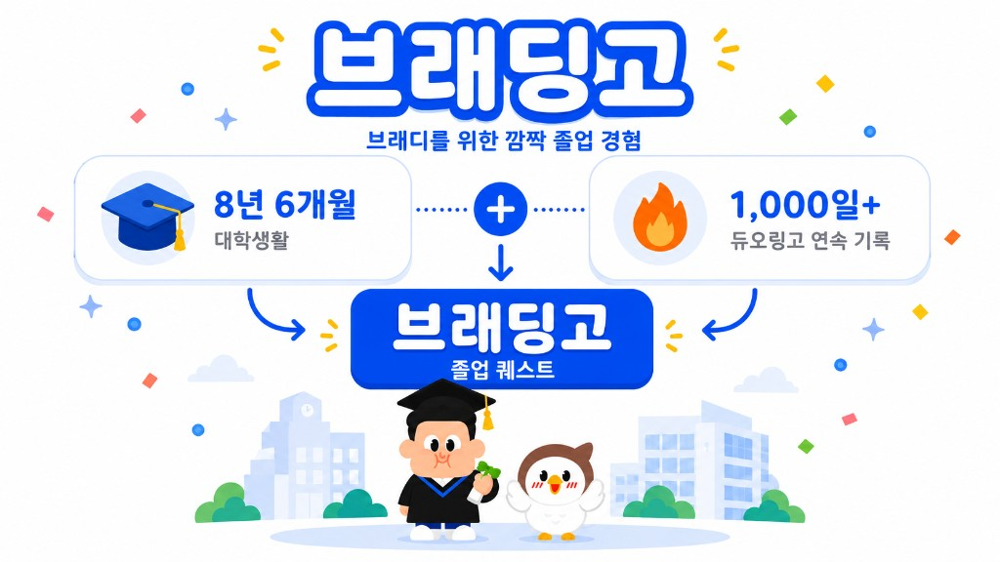
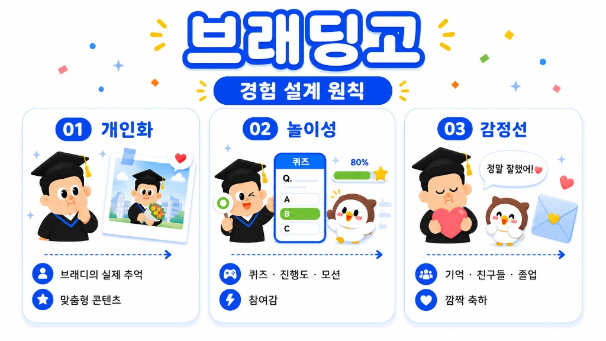
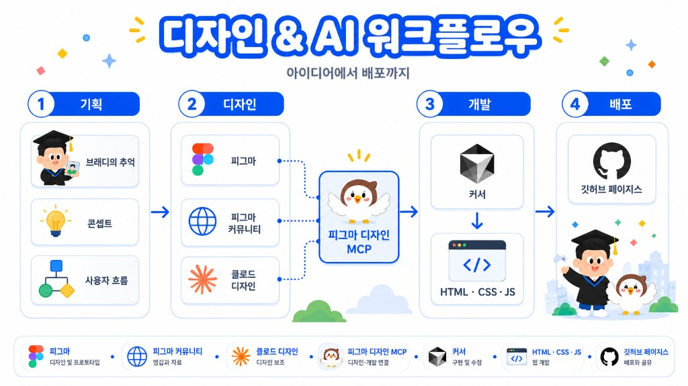

# BRADINGO 🎓

### A Surprise Graduation Experience for Bradie

> **8년 6개월의 대학생활을 마친 친구를 위해 만든  
> 단 하나뿐인 인터랙티브 졸업 서프라이즈 웹페이지**

**Play:** [https://yazii4362.github.io/BRADINGO-2026/](https://yazii4362.github.io/BRADINGO-2026/)

<p>
  
  
  
  
  
</p>
<p>
  
  
  
  
  
  
  
</p>

BRADINGO는 **8년 6개월 동안 성실하게 학교생활을 해온 저의 친구 Bradie의 졸업을 축하하기 위해 제작한 개인적인 서프라이즈 웹 프로젝트**입니다.

Bradie는 실제로 **Duolingo 연속 학습 기록 1,000일을 돌파할 정도로 꾸준히 Duolingo를 사용해온 친구**입니다.

친구에게 익숙하면서도 재미있는 방식으로 졸업을 축하하고 싶어, **Duolingo의 학습 코스와 게임형 UX에서 아이디어를 얻어 Bradie의 대학생활을 하나의 `Graduation Quest`로 재구성**했습니다.

Figma Community의 오픈소스 디자인 리소스를 참고하고, 친구와 관련된 실제 에피소드, 사진, 밈, 졸업 축하 메시지와 직접 제작한 캐릭터 및 그래픽을 더해 BRADINGO만의 비주얼 시스템을 만들었습니다.

**7월 말부터 약 2주간 기획 → 디자인 → 개발을 진행했으며, 최종적으로 실제 웹페이지 형태로 구현하여 배포까지 완료했습니다.**

**친구가 직접 문제를 풀고 지난 추억을 발견하며 마지막 졸업까지 도착하는 과정에 게임처럼 몰입할 수 있도록 디자인했습니다.**

---

## Preview

<p align="center">
  
</p>

---

## Background

Bradie에게는 두 개의 긴 기록이 있습니다.

### 🎓 University Life

**8년 6개월**

오랜 대학생활을 마무리하고 졸업을 맞이했습니다.

### 🔥 Duolingo Streak

**1,000+ Days**

꾸준히 Duolingo를 사용하며 1,000일 이상의 연속 학습 기록을 이어왔습니다.

두 기록을 연결하면서 BRADINGO의 콘셉트를 정했습니다.

> **“8년 6개월의 대학생활을 하나의 긴 학습 코스로 표현하면 어떨까?”**

Bradie가 익숙하게 사용해온 학습 서비스의 진행 방식을 졸업이라는 상황에 맞게 재구성하고, 학교생활의 에피소드와 추억을 하나씩 경험하며 마지막 `Graduation` 단계까지 도착하도록 전체 흐름을 설계했습니다.

---

## Experience Flow

```text
Intro
  ↓
Course Map
  ↓
학교생활 Quiz
  ↓
졸업 자격 심사
  ↓
우리의 추억
  ↓
친구들의 졸업 축하 메시지
  ↓
Graduation Ending
```

각 단계에는 Bradie와 친구들이 실제로 공유했던 이야기와 콘텐츠를 활용했습니다.

문제를 풀고, 사진을 보고, 친구들의 메시지를 확인하는 행동이 이어지면서 8년 6개월의 대학생활을 하나의 작은 게임처럼 경험하도록 구성했습니다.

---

## Design Focus

<p align="center">
  
</p>

### 01. Personalization

가장 중요하게 생각한 부분은 **Bradie라는 한 사람에게 얼마나 자연스럽게 맞춰진 경험을 만들 수 있는가**였습니다.

프로젝트 전반에 실제 Bradie의 대학생활에서 가져온 소재를 사용했습니다.

- 학교생활 에피소드
- 친구들만 이해할 수 있는 밈
- 실제 추억 사진
- 좋아했던 음식과 장소
- 친구들의 졸업 축하 메시지
- 8년 6개월의 대학생활
- Duolingo 1,000일 이상의 연속 기록

각 화면에서 Bradie와 관련된 이야기가 자연스럽게 이어지도록 콘텐츠와 인터랙션을 함께 설계했습니다.

### 02. Graduation as a Journey

졸업까지 도착하는 과정 전체가 하나의 경험이 되도록 구성했습니다.

Course Map을 중심으로 각 콘텐츠를 단계별로 진행하고, 완료 여부와 현재 위치를 시각적으로 구분했습니다.

```text
Completed → Active → Locked
```

사용자는 자신의 위치와 다음에 진행할 콘텐츠를 바로 파악할 수 있으며, Course Map 자체가 Bradie의 대학생활을 표현하는 하나의 여정처럼 보이도록 디자인했습니다.

### 03. Familiar UX

Bradie가 오랫동안 Duolingo를 사용해왔다는 점을 UX에도 반영했습니다.

다음과 같은 게임형 학습 서비스의 사용 방식을 참고했습니다.

- Course Map
- 단계별 Progress
- 선택형 Quiz
- 정답 / 오답 Feedback
- 완료 상태 표현
- 다음 단계 안내
- Button Press Motion
- Character Reaction

처음 접하는 화면에서도 별도의 설명 없이 바로 진행할 수 있도록 익숙한 인터랙션 문법을 활용했습니다.

### 04. Character & Visual System

프로젝트에 사용되는 캐릭터와 그래픽을 BRADINGO의 분위기에 맞게 구성했습니다.

Bradie를 표현한 캐릭터와 프로젝트 마스코트 **이루매**, 서울시립대학교 캠퍼스, 졸업복과 학사모 등의 그래픽 요소가 하나의 화면 안에서 자연스럽게 어우러지도록 스타일을 통일했습니다.

**Visual Assets**

- Bradie Character
- 이루매 Mascot
- Graduation Character Variations
- Campus Illustration
- Course Node
- Favicon
- OG Thumbnail
- Ending Graphic
- Character Motion Assets

학교 건물은 실제 서울시립대학교 건물의 형태와 외관 특징을 참고해 프로젝트의 그래픽 스타일로 재구성했습니다.

### 05. Mobile First

BRADINGO는 친구에게 링크를 보내고 스마트폰에서 바로 경험하는 상황을 기준으로 제작했습니다.

**390px 모바일 화면**을 기본 기준으로 디자인하고, 데스크톱에서도 모바일 경험의 집중도를 유지하도록 화면 너비를 제한했습니다.

모바일 사용성을 위해 다음 요소를 고려했습니다.

- 한 손으로 누르기 쉬운 버튼 크기
- 짧은 화면 단위의 콘텐츠
- 명확한 시각적 위계
- 화면 이동 시 즉각적인 피드백
- 새로고침 후 진행 상태 유지
- 이미지 저장 및 공유
- 모바일 Safe Area

### 06. Motion & Feedback

모션은 사용자의 행동과 화면의 상태 변화를 전달하는 피드백으로 활용했습니다.

**주요 Motion**

- Screen Transition
- Button Press
- Active Course Node
- Next Stage Animation
- Quiz Correct / Incorrect Feedback
- Character Motion
- Ending Animation

각 인터랙션이 사용자의 다음 행동을 자연스럽게 안내하도록 강도와 속도를 조정했습니다.

---

## UI

### Intro

서울시립대학교 캠퍼스와 졸업 캐릭터를 중심으로 BRADINGO의 첫인상을 구성했습니다.

사이트에 접속했을 때 졸업을 주제로 한 게임형 프로젝트라는 점을 빠르게 이해할 수 있도록 디자인했습니다.

### Course Map

Course Map은 전체 경험의 중심 화면입니다.

각 단계의 진행 상태와 현재 위치를 시각적으로 표현하고, 사용자는 Course Map을 중심으로 콘텐츠를 차례대로 경험합니다.

### Quiz

Bradie의 실제 학교생활과 친구들과의 에피소드를 Quiz 형태로 구성했습니다.

직접 답을 선택하면서 기억과 이야기를 다시 떠올릴 수 있도록 하고, 결과에 따라 즉각적인 시각적 피드백을 제공합니다.

### Memories

친구들과 함께한 사진과 대학생활의 기록을 담은 콘텐츠입니다.

시간의 흐름과 에피소드가 자연스럽게 이어지도록 사진과 텍스트의 순서를 구성했습니다.

### Graduation Messages

함께 학교생활을 보낸 친구들의 졸업 축하 메시지를 담았습니다.

앞선 학교생활과 추억 콘텐츠를 거쳐 친구들의 메시지에 도착하도록 배치해 마지막 졸업까지 감정의 흐름이 이어지도록 설계했습니다.

### Ending

마지막 단계에서는 전체 코스를 완료했다는 성취감과 졸업 축하의 분위기를 함께 전달합니다.

완료 후에는 졸업 기념 이미지를 저장하거나 공유할 수 있도록 구성했습니다.

---

## Tech Stack

### Languages & Frontend

<p>
  
  
  
  
</p>

### Design

<p>
  
  
  
</p>

### AI-assisted Development

<p>
  
  
</p>

### Version Control & Deployment

<p>
  
  
</p>

---

## Design & AI Workflow

<p align="center">
  
</p>

약 2주의 제작 기간 동안 **기획 → 디자인 → 개발 → 배포**까지 전체 과정을 반복하며 완성했습니다.

프로젝트의 콘셉트, UX Flow, 콘텐츠 구성, 캐릭터 설정, 비주얼 방향과 최종 디자인 판단은 직접 진행했습니다.

AI 도구와 MCP는 디자인 탐색, 구현, 디버깅의 속도를 높이고 디자인과 개발 사이의 연결을 원활하게 만드는 데 활용했습니다.

### Planning

```text
Bradie의 특징과 추억 정리
        ↓
Graduation Quest Concept
        ↓
Information Architecture
        ↓
User Flow
```

### Design

```text
Reference Research
        ↓
Figma Community
        ↓
Wireframe
        ↓
Visual Direction
        ↓
Character / Graphic
        ↓
UI Design
```

### Development

```text
Figma
   ↓
Figma Design MCP
   ↓
Cursor
   ↓
Frontend Implementation
   ↓
Interaction / Debugging
   ↓
Deploy
```

### Tools

| Tool                 | Role                          |
| -------------------- | ----------------------------- |
| **Figma**            | UI 디자인, 컴포넌트 제작, 비주얼 시스템 설계   |
| **Figma Community**  | 오픈소스 디자인 리소스 및 UI 레퍼런스         |
| **Figma Design MCP** | 디자인 컨텍스트를 개발 환경으로 전달          |
| **Cursor**           | Frontend 구현, 인터랙션, 디버깅, 리팩터링    |
| **Claude Design**    | UI 방향 탐색, 디자인 아이디어 및 시안 검토     |

---

## Key Features

- 🎓 Graduation Quest
- 🗺 Interactive Course Map
- 🧩 Personalized Quiz
- 📸 Memory Archive
- 💌 Graduation Messages
- 🧑‍🎓 Personalized Character
- 🐦 Original Mascot
- 💾 Progress Persistence
- 🎞 Micro Interaction
- 📱 Mobile-first Responsive Design
- 🖼 Graduation Image Save
- 📤 Mobile Share
- 🔗 OG Thumbnail & Favicon

---

## Production

**약 2주**

```text
7월 말
│
├─ Concept & Planning
├─ User Flow
├─ Visual Direction
├─ Character / Graphic Design
├─ UI Design
├─ Frontend Development
├─ Interaction
├─ Responsive QA
└─ Deploy
```

실제 브라우저에서 결과를 확인하며 디자인과 개발을 반복적으로 조정하는 방식으로 작업했습니다.

---

## What I Focused On

BRADINGO를 디자인하면서 가장 중요하게 생각한 질문은 다음과 같습니다.

> **“Bradie에게 의미 있는 기억을 웹 인터랙션으로 어떻게 표현할 것인가?”**

### 01. Bradie에게만 의미 있는 콘텐츠

실제 학교생활, 친구들과의 에피소드, 사진, 밈과 메시지를 콘텐츠의 중심으로 사용했습니다.

### 02. 다음 단계에 대한 기대감

콘텐츠를 단계별로 구성해 다음 화면에 어떤 이야기가 등장할지 궁금증이 이어지도록 설계했습니다.

### 03. 기억을 행동으로 경험하는 방식

문제를 풀고, 답을 선택하고, 사진을 탐색하며 사용자가 직접 프로젝트에 참여하도록 구성했습니다.

### 04. 하나의 세계처럼 연결되는 비주얼

Bradie 캐릭터, 이루매, 캠퍼스, Course Map과 졸업 그래픽을 같은 비주얼 시스템 안에서 디자인했습니다.

### 05. 마지막까지 이어지는 감정의 흐름

인트로에서 시작해 학교생활, 추억, 친구들의 메시지를 거쳐 졸업 엔딩에 도착하도록 전체 콘텐츠의 순서를 설계했습니다.

---

## Result

BRADINGO는 **친구 Bradie를 위해 약 2주 동안 기획, 디자인, 개발하여 실제로 배포한 개인적인 졸업 서프라이즈 프로젝트**입니다.

Bradie의 **8년 6개월 대학생활**과 **Duolingo 1,000일 이상의 연속 기록**을 핵심 소재로 삼아 그의 대학생활을 하나의 `Graduation Quest`로 표현했습니다.

친구가 직접 문제를 풀고 지난 추억을 발견하며 마지막 졸업까지 도착하는 과정에 게임처럼 몰입할 수 있도록 제작했습니다.

---

## Note

BRADINGO는 친구 Bradie의 졸업을 축하하기 위해 제작한 **개인적인 비상업적 서프라이즈 프로젝트**입니다.

실제 친구들과의 추억과 개인적인 이야기를 기반으로 제작했으며 공식 학교 프로젝트나 상용 서비스와 관련이 없습니다.

Duolingo의 학습 코스와 게임형 UX에서 영감을 받아 제작했으며, 캐릭터, 그래픽, 콘텐츠 및 구현은 BRADINGO 프로젝트에 맞게 구성했습니다.
